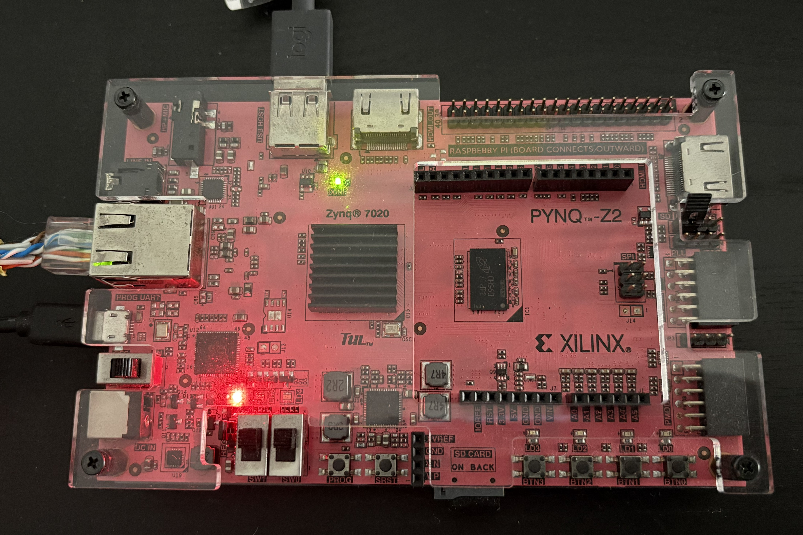

# FPGA-Based Real-Time Hand Gesture Recognition

## Overview

This project implements a real-time hand gesture recognition system using CNN and OpenCV, designed for FPGA deployment using PYNQ-Z2.

## Features

* Real-time hand gesture detection using webcam
* CNN-based classification model
* Segmentation-assisted recognition
* Designed for edge AI deployment

## Tech Stack

* Python
* OpenCV
* TensorFlow / Keras
* PYNQ-Z2
* Xilinx Vivado

## How it works

1. Capture hand using webcam
2. Process image using OpenCV
3. Feed into trained CNN model
4. Output predicted gesture

## FPGA Board

## Future Improvements

* Full FPGA acceleration
* More gesture classes
